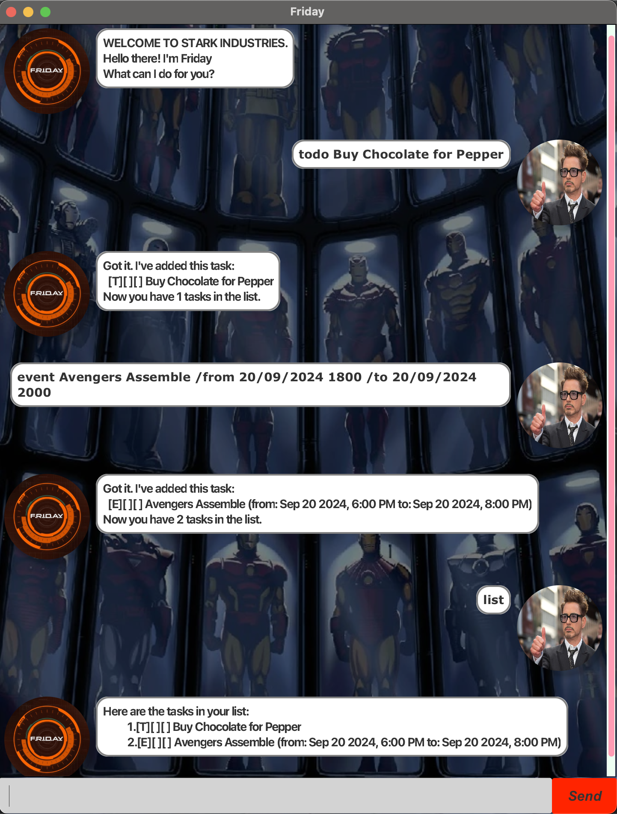

# Friday User Guide



Friday is a desktop app for **managing your tasks, optimized for use via a Command Line Interface (CLI)** while still 
having the benefits of a GUI. If you can type fast, Friday can help you manage your deadlines faster than ever.

- Quickstart
- Features
  * Adding tasks: 
    + Todo task: `todo`
    + Deadline task: `deadline`
    + Event task: `event`
  * Listing all tasks: `list`
  * Mark/Unmark a task: `mark`/ `unmark`
  * Delete a task: `delete`
  * Find task by name: `find`
  * Find tasks by date: `date`
  * Prioritise tasks: `priority`
  * Exit the program: `bye`
  * Saving the data
  * Clear all tasks: `clear`
- FAQ

---

## Quick Start

1. Ensure you have Java `17` installed in your Computer.
2. Download the latest `.jar` file from [here](https://github.com/wang-h-z/ip).
3. Copy the file to the folder you want to use as the _home folder_ for Friday.
4. Open a command terminal, `cd` into the folder you put the jar file in, and use the `java -jar Friday.jar` command to run
the application.\
A GUI similar to the above should appear in a few seconds. Note that the app does not begin with sample data.
5. Type the command in the command box and press Enter to execute it. \
Some example commands you can try:
- `list`: Lists all tasks.
- `todo Homework Assignment`: Adds a Todo task with the description `Homework Assignment`
- `bye`: Exits the app.
6. Refer to the Features below for details of each command. 

---

## Features

> ❗ **Note:**
> - Words in `UPPER_CASE` are the parameters to be supplied by the user. 
> 
>   e.g. in `todo DESCRIPTION`, `DESCRIPTION` is a parameter which can be used as `todo Buy Milk`.
> - Parameters must be filled.
> 
>   e.g. If a command specifies `todo DESCRIPTON`, then the user must give an input to `DESCRIPTION`.
> - Parameters labelled as `ID` must be within the list's index (1-base indexing)
> - Parameters labelled as `FORMATTED_DATE` must follow a certain DateTime format to be compared chronologically. 
> See relevant features for more details.
> - Parameters **must** be in a specific order.
> 
>   e.g. if the command specifies `event DESCRIPTION /from DATE_1 /to DATE_2`, then 
> `event DESCRIPTION /to DATE_2 /from DATE_1` is not valid.
> - Extraneous parameters for commands that do not take in parameters such as (`list` and `bye`) will be ignored.
> 
>   e.g. if the command given is `list 123`, it will be interpreted as `list`.
> 

## Adding tasks:

### Adding a Todo Task: `todo`

Adds a Todo task to the list of tasks.

Format: `todo DESCRIPTION`

Examples: 
- `todo Buy Milk`

Expected Output:
```
Got it. I've added this task:
  [T][ ][ ] Buy Milk
Now you have 1 tasks in the list.
```  
<br>

### Adding a Deadline task: `deadline`
Adds a Deadline task to the list of tasks.

Format: `deadline DESCRIPTIPON /by DEADLINE`

>❗ **Note:** `DEADLINE` can be replaced with a `FORMATTED_DATE` if used in this format: `dd/mm/yy HHmm`.

Examples:
- `deadline Return Book /by Sunday`

Expected Output: 
```
Got it. I`ve added this task: 
  [D][ ][ ] Return Book (by: Sunday)
 Now you have 2 tasks in the list.
```
<br>

### Adding an Event task: `event`
Adds an Event task to the list of tasks.

Format: `event DESCRIPTION /from DATE_1 to /to DATE_2`

> ❗ **Note:** `DATE_1` and `DATE_2` can be replaced with a `FORMATTED_DATE` if used in this format: `dd/mm/yy HHmm`.

Examples: 
- `event Build Lego /from Next Saturday /to Next Sunday`
- `event Project Meeting /from 2024-09-19 14:00 /to 2024-09-19 16:00`

Expected Output: 
```
Got it. I've added this task: 
  [E][ ][ ] Build Lego (from: Next Satuday to: Next Sunday)
Now you have 3 tasks in the list.

OR

Got it. I've added this task: 
  [E][ ][ ] Project meeting (from: Sep 19 2024, 2:00 pm to: Sep 19 2024, 4:00 pm)
Now you have 3 tasks in the list.
```
<br>

### Listing all tasks: `list`

Shows a list of all the user's tasks.

Format: `list`

Expected Output: 
```
Here are the tasks in your list: 
  1. [T][ ][ ] Buy Milk
  2. [D][ ][ ] Return Book (by: Sunday)
  3. [E][ ][ ] Build Lego (from: Next Satuday to: Next Sunday)
```
<br>

### Mark/Unmark a task: `mark`/`unmark`

Mark/Unmark a task in the list.

Format: `mark ID` / `unmark ID`

Examples: 
- `mark 2`
- `unmark 1`

Expected Output: 
```
Nice! I've marked this task as done: 
  [D][ ][X] Return Book (by: Sunday)
  
OR

OK, I've marked this task as not done yet: 
  [T][ ][ ] Buy Milk
```
<br> 

### Delete a task: `delete`

Deletes a task in the list.

Format: `delete ID`

Examples: 
- `delete 2`

Expected Output: 
```
Got it. I've removed this task: 
  [D][ ][X] Return Book (by: Sunday)
Now you have 2 tasks in the list.
```
<br> 

### Find tasks by name: `find`

Returns a list of all tasks that contains that name.

Format: `find DESCRIPTION`

Examples: 
- `find Milk`

Expected Output:
```
Here are the matching tasks in your list: 
  1. [T][ ][ ] Buy Milk
```
<br>

### Find tasks by date: `date`
Returns a full list of tasks that need to be done by a certain date.

Format: `date FORMATTED_DATE`

Examples: 
- `date 19/09/2024 1700`

Expected Output
```dtd
Here are the tasks that need to be done by this date: FORMATTED DATE
    1. [E][ ][ ] Project meeting (from: Sep 19 2024, 2:00 pm to: Sep 19 2024, 4:00 pm)
```
<br>

### Prioritise tasks: `priority`

Sets the priority of a task. 

Format: `priority ID /lvl LEVEL`

Examples:
- `priority 1 /lvl HIGH`

Expected output: 
```
Nice! I've added a priority to this task:
  [T][H][ ] Buy Milk
```
<br>

### Exit the program: `bye`

Format: `bye`

Expected output: 
```
Bye. Hope to see you again soon!
```
<br> 

### Saving the data
Friday's data are saved in the hard disk automatically after any command that changes the data. There 
is no need to save manually.

<br>

### Clear the data: `clear`
_Details coming soon ..._

---

## FAQ
**Q**: How do I transfer my data to another Computer? \
**A**: Install the app in the other computer and overwrite the empty data file it creates with the file
that contains the data of your previous Friday folder.
---

